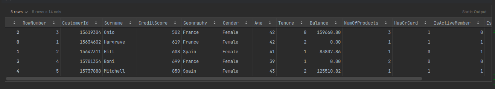
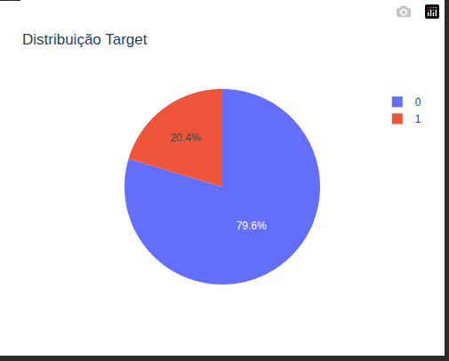
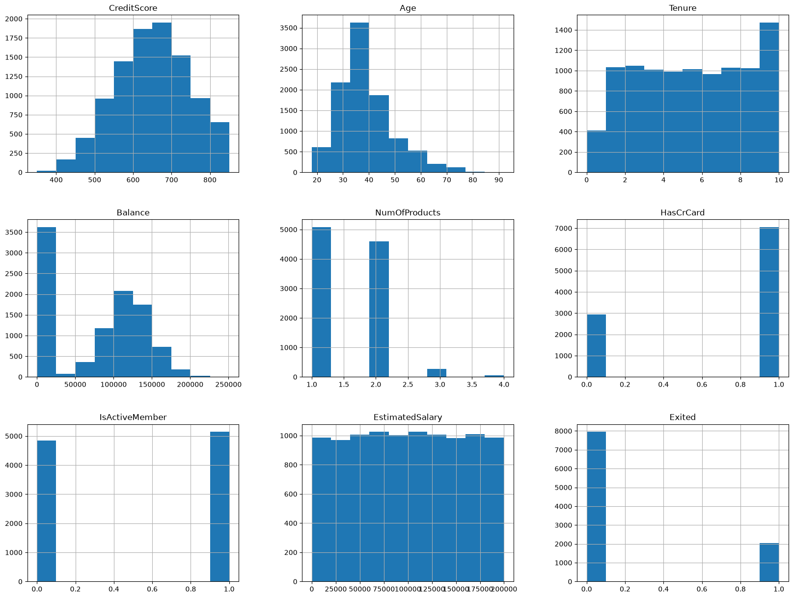
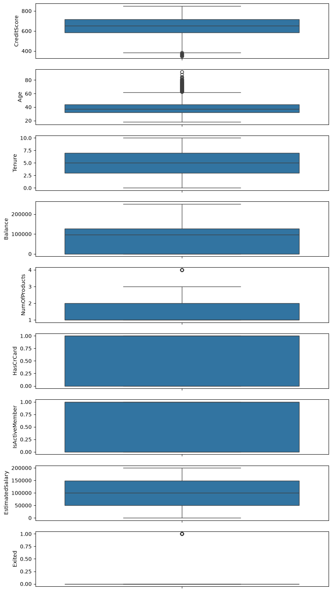
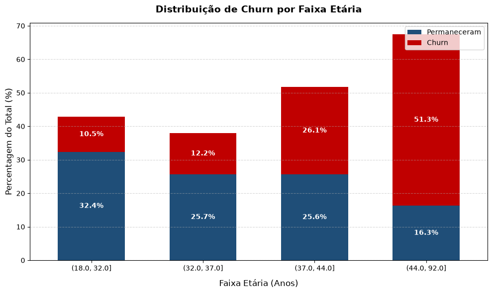
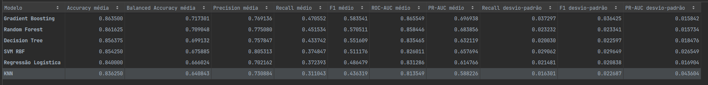
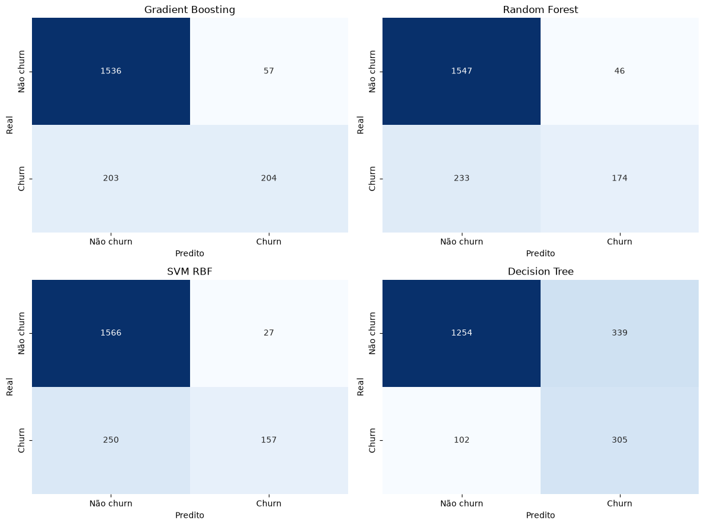
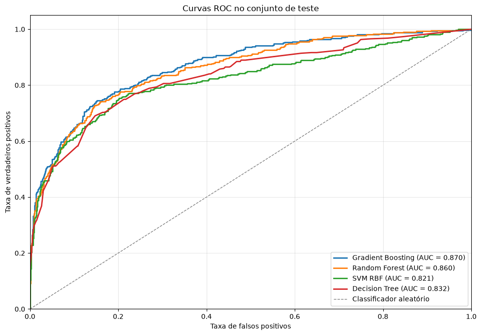
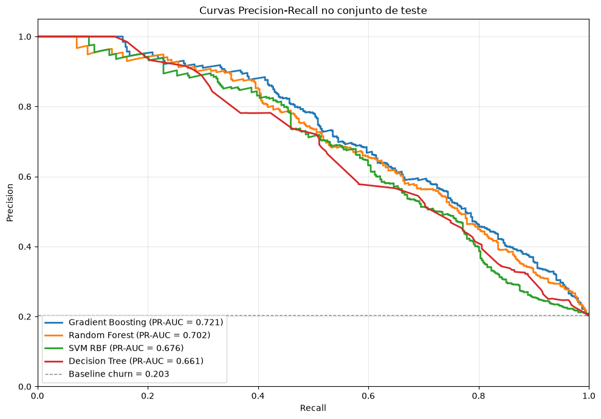
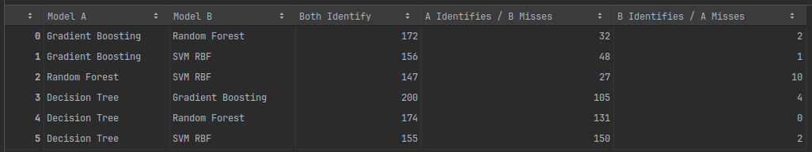

# Predição de Churn Bancário Utilizando Técnicas de Machine Learning: Uma Análise Comparativa e Comportamental dos Modelos

**Pontifícia Universidade Católica de Minas Gerais**

**Pós-graduação em Ciência de Dados e Inteligência Artificial**

**Disciplina:** Machine Learning

**Aluno:** Rodrigo Emygdio

**Professor:** _______________________________________

**Data:** ____ / ____ / ______

---

# Sumário

1. Introdução
2. Objetivos
3. Descrição do Dataset
4. Metodologia
5. Resultados
6. Análise Comportamental dos Modelos
7. Aplicação Desenvolvida
8. Conclusão
9. Limitações
10. Trabalhos Futuros

---

# 1. Introdução

A retenção de clientes representa um dos principais desafios enfrentados pelas instituições financeiras modernas. Em um mercado altamente competitivo, conquistar novos clientes exige investimentos significativos em campanhas de marketing, programas de fidelização e desenvolvimento de novos produtos, tornando a manutenção da base atual um fator estratégico para a sustentabilidade do negócio. Nesse contexto, a identificação antecipada de clientes com alta probabilidade de cancelamento de relacionamento, fenômeno conhecido como *customer churn*, permite que as organizações adotem ações preventivas capazes de reduzir perdas financeiras e aumentar o valor do cliente ao longo do tempo.

Nos últimos anos, o avanço das técnicas de Ciência de Dados e Aprendizado de Máquina tornou possível construir modelos capazes de estimar a probabilidade de churn a partir do histórico cadastral e comportamental dos clientes. Esses modelos vêm sendo amplamente utilizados em setores como bancos, telecomunicações, seguradoras e comércio eletrônico, auxiliando gestores na definição de estratégias de retenção direcionadas aos clientes com maior risco de evasão.

Embora a literatura frequentemente concentre esforços na comparação entre algoritmos utilizando métricas tradicionais de classificação, como acurácia, precisão, recall e área sob a curva ROC, tais indicadores fornecem apenas uma visão global do desempenho dos modelos. Em muitos cenários, modelos com métricas semelhantes podem aprender padrões distintos dos dados, identificando corretamente grupos diferentes de clientes. Dessa forma, compreender apenas o desempenho agregado pode ocultar limitações importantes relacionadas aos perfis efetivamente reconhecidos pelos algoritmos.

Diante desse contexto, este trabalho propõe não apenas a construção e comparação de modelos preditivos para identificação de churn, mas também uma investigação sobre o comportamento individual dos classificadores. Além da avaliação quantitativa tradicional, são analisadas as regiões do espaço de atributos aprendidas por cada algoritmo, identificando perfis de clientes corretamente classificados, regiões compartilhadas entre os modelos e grupos que permanecem como zonas cegas para todos os classificadores avaliados.

Para esse estudo foi utilizado o conjunto de dados **Churn Modelling Dataset**, amplamente empregado em pesquisas acadêmicas e disponibilizado na plataforma Kaggle. O projeto contempla todas as etapas de um fluxo típico de Ciência de Dados, iniciando pela análise exploratória dos dados, passando pelo pré-processamento, treinamento e otimização de diferentes algoritmos de Machine Learning, até a construção de uma aplicação para realização de inferências sobre novos clientes.

Como resultado, espera-se não apenas identificar o modelo com melhor desempenho preditivo, mas também compreender como diferentes técnicas de aprendizado representam o problema de churn, fornecendo subsídios para futuras aplicações em apoio à tomada de decisão.

---

# 2. Objetivos

## 2.1 Objetivo Geral

Desenvolver um sistema de predição de churn utilizando técnicas de Machine Learning, comparando diferentes algoritmos de classificação e analisando seus comportamentos preditivos na identificação de clientes com maior probabilidade de cancelamento de relacionamento.

## 2.2 Objetivos Específicos

- Realizar a análise exploratória do conjunto de dados, identificando padrões, distribuições e possíveis problemas de qualidade dos dados.

- Executar o pré-processamento necessário para preparação dos dados, incluindo tratamento das variáveis categóricas, engenharia de atributos e divisão entre conjuntos de treinamento e teste.

- Construir modelos utilizando diferentes algoritmos de classificação, incluindo Regressão Logística, K-Nearest Neighbors (KNN), Support Vector Machine (SVM), Decision Tree, Random Forest e Gradient Boosting.

- Avaliar o desempenho dos modelos utilizando múltiplas métricas de classificação, considerando especialmente Precision, Recall, F1-Score, ROC-AUC e PR-AUC.

- Realizar otimização de hiperparâmetros por meio de validação cruzada utilizando GridSearchCV.

- Investigar o comportamento dos classificadores por meio da análise das regiões compartilhadas e exclusivas aprendidas por cada modelo.

- Desenvolver uma aplicação gráfica capaz de utilizar o modelo selecionado para realizar inferências sobre novos clientes.

---

# 3. Descrição do Dataset

## 3.1 Fonte dos Dados

O conjunto de dados utilizado neste trabalho corresponde ao **Churn Modelling Dataset**, disponibilizado publicamente na plataforma Kaggle. Trata-se de um dataset amplamente empregado em estudos de classificação supervisionada, sendo frequentemente utilizado para demonstração de técnicas de Machine Learning voltadas à predição de evasão de clientes no setor bancário.

O conjunto possui informações cadastrais e financeiras de clientes de uma instituição bancária fictícia, contendo atributos relacionados ao perfil demográfico, relacionamento com o banco e características financeiras.

## 3.2 Caracterização do Dataset

O conjunto de dados é composto por **10.000 registros**, cada um representando um cliente distinto da instituição financeira. A variável alvo do problema é denominada **Exited**, indicando se o cliente permaneceu ativo ou encerrou seu relacionamento com o banco.

A distribuição da variável alvo apresenta desbalanceamento moderado, característica frequentemente encontrada em problemas reais de classificação relacionados à retenção de clientes.

| Classe | Descrição                         |
|--------|-----------------------------------|
| 0      | Cliente permaneceu na instituição |
| 1      | Cliente realizou churn            |

Ao longo do projeto foram utilizadas exclusivamente variáveis disponíveis no momento da tomada de decisão, evitando o uso de informações que poderiam representar vazamento de dados (*data leakage*).

## 3.3 Descrição das Variáveis

O conjunto de dados é composto pelas seguintes variáveis:

| Variável        | Descrição                           |
|-----------------|-------------------------------------|
| CreditScore     | Pontuação de crédito do cliente     |
| Geography       | País de residência                  |
| Gender          | Sexo do cliente                     |
| Age             | Idade                               |
| Tenure          | Tempo de relacionamento com o banco |
| Balance         | Saldo em conta                      |
| NumOfProducts   | Quantidade de produtos contratados  |
| HasCrCard       | Possui cartão de crédito            |
| IsActiveMember  | Cliente ativo                       |
| EstimatedSalary | Salário estimado                    |
| Exited          | Variável alvo (Churn)               |

Durante a etapa de modelagem, a variável **NumOfProducts** foi transformada em uma nova variável categórica denominada **ProductsGroup**, visando reduzir problemas de separação completa observados na modelagem estatística e melhorar a estabilidade dos modelos.

## 3.4 Análise Exploratória dos Dados

A etapa de Análise Exploratória dos Dados (EDA) teve como objetivo compreender a estrutura do conjunto de dados, identificar padrões relevantes e subsidiar as decisões adotadas durante o pré-processamento e modelagem.

Foram avaliadas as distribuições individuais das variáveis, correlações, presença de valores discrepantes, distribuição da variável alvo e possíveis relações entre as características dos clientes e a ocorrência de churn.

As análises evidenciaram diferenças importantes entre clientes que permaneceram e aqueles que realizaram churn, especialmente em atributos como idade, número de produtos contratados, atividade do cliente e saldo bancário, indicando potencial capacidade preditiva dessas variáveis.

Além disso, observou-se que o conjunto de dados apresentava qualidade adequada para utilização em modelos supervisionados, não sendo identificados problemas significativos relacionados a valores ausentes ou inconsistências estruturais.

**Figura 1 – Primeiras linhas do conjunto de dados**

 

**Figura 2 – Distribuição da variável alvo**

 

**Figura 3 – Principais visualizações da Análise Exploratória dos Dados**

 



# 4. Metodologia

A construção de modelos preditivos de qualidade depende não apenas da escolha do algoritmo, mas também da definição de uma metodologia capaz de garantir que os resultados obtidos representem adequadamente o comportamento esperado do modelo em dados não observados. Dessa forma, este trabalho adotou um fluxo de desenvolvimento estruturado, contemplando desde o pré-processamento dos dados até a seleção do modelo final por meio de validação cruzada e otimização de hiperparâmetros.

A metodologia foi organizada em etapas sequenciais, reduzindo riscos de vazamento de informação (*data leakage*) e permitindo que todos os modelos fossem avaliados sob exatamente as mesmas condições experimentais.

---

## 4.1 Fluxo Geral do Projeto

O fluxo adotado neste trabalho é ilustrado na Figura 4.

> **Figura 4 – Pipeline de desenvolvimento do modelo**
>
> *Inserir fluxograma contendo as etapas:*
>
> Dataset → EDA → Pré-processamento → Divisão Treino/Teste → Cross Validation → GridSearchCV → Avaliação Final → Aplicação.

Inicialmente foi realizada a análise exploratória dos dados com o objetivo de compreender a distribuição das variáveis, identificar possíveis inconsistências e investigar relações entre as características dos clientes e a variável alvo.

Após essa etapa, foi realizado o pré-processamento do conjunto de dados, preparando as variáveis para utilização pelos algoritmos de aprendizado supervisionado.

Em seguida, o conjunto de dados foi dividido em conjuntos de treinamento e teste. Todo o processo de seleção de modelos, validação cruzada e otimização foi realizado exclusivamente sobre o conjunto de treinamento, preservando o conjunto de teste para uma única avaliação final. Essa estratégia evita que decisões de modelagem sejam influenciadas pelos dados utilizados para validação do desempenho final, produzindo uma estimativa mais realista da capacidade de generalização dos modelos.

---

## 4.2 Pré-processamento dos Dados

Embora o conjunto de dados apresentasse boa qualidade estrutural, algumas transformações foram necessárias para adequá-lo aos algoritmos de Machine Learning utilizados neste estudo.

Inicialmente foram removidas variáveis que não apresentavam capacidade preditiva, como identificadores únicos de clientes, evitando que informações sem significado estatístico influenciassem o treinamento dos modelos.

As variáveis categóricas foram convertidas para representação numérica por meio da técnica de **One-Hot Encoding**, preservando a natureza nominal das categorias sem introduzir relações ordinais artificiais entre seus valores.

Durante a etapa de modelagem estatística observou-se que a variável **NumOfProducts** apresentava problemas de separação completa, dificultando a estimação estável dos coeficientes da regressão logística. Para contornar esse problema foi criada uma nova variável denominada **ProductsGroup**, agrupando clientes conforme a quantidade de produtos contratados. Essa transformação preservou o significado de negócio da variável e melhorou sua utilização tanto nos modelos estatísticos quanto nos algoritmos de Machine Learning.

Outra decisão importante envolveu a padronização das variáveis numéricas. Como algoritmos baseados em distância são sensíveis à escala das variáveis, o escalonamento foi aplicado apenas aos modelos que efetivamente dependem dessa característica.

---

## 4.3 Escalonamento das Variáveis

Os algoritmos utilizados neste estudo possuem características matemáticas distintas. Alguns dependem diretamente do cálculo de distâncias entre observações, enquanto outros são praticamente invariantes à escala das variáveis.

Por esse motivo, optou-se por aplicar padronização (*StandardScaler*) apenas aos modelos que realmente necessitam desse procedimento.

A Tabela 1 apresenta a estratégia adotada.

| Modelo                 | Escalonamento |
|------------------------|---------------|
| Logistic Regression    | Sim           |
| K-Nearest Neighbors    | Sim           |
| Support Vector Machine | Sim           |
| Decision Tree          | Não           |
| Random Forest          | Não           |
| Gradient Boosting      | Não           |

Essa abordagem evita transformações desnecessárias sobre modelos baseados em árvores de decisão, preservando sua interpretação natural e reduzindo processamento computacional.

---

## 4.4 Pipeline de Treinamento

Para garantir que todas as etapas de transformação fossem aplicadas corretamente durante validação cruzada e otimização de hiperparâmetros, todos os modelos foram implementados utilizando a estrutura **Pipeline** da biblioteca Scikit-Learn.

Essa abordagem garante que todas as transformações, como codificação das variáveis categóricas e escalonamento, sejam aprendidas exclusivamente a partir dos dados de treinamento de cada *fold*, eliminando riscos de vazamento de informação.

Além disso, o uso de *Pipelines* simplifica a reutilização do modelo posteriormente na aplicação desenvolvida, permitindo que exatamente o mesmo fluxo utilizado durante o treinamento seja empregado durante a realização de novas predições.

---

## 4.5 Divisão entre Treinamento e Teste

O conjunto de dados foi dividido em dois subconjuntos independentes:

- Conjunto de treinamento;
- Conjunto de teste.

O conjunto de treinamento foi utilizado durante todas as etapas de desenvolvimento dos modelos, incluindo validação cruzada, comparação entre algoritmos e otimização de hiperparâmetros.

Já o conjunto de teste permaneceu completamente isolado durante todo o processo, sendo utilizado apenas uma única vez para obtenção da avaliação final dos modelos.

Essa estratégia evita que informações do conjunto de teste influenciem o processo de seleção dos algoritmos, produzindo uma estimativa mais confiável da capacidade de generalização.

---

## 4.6 Validação Cruzada

A comparação entre os modelos foi realizada utilizando validação cruzada (*Stratified Cross Validation*), técnica amplamente utilizada em problemas supervisionados por reduzir a variabilidade associada a uma única divisão treino/teste.

Durante esse procedimento, o conjunto de treinamento é dividido em múltiplas partições (*folds*). Em cada iteração, um dos subconjuntos é utilizado para validação enquanto os demais permanecem responsáveis pelo treinamento do modelo. Ao final, as métricas são calculadas pela média dos resultados obtidos em todos os *folds*.

A utilização da versão estratificada garante que a proporção entre clientes que realizaram e não realizaram churn permaneça aproximadamente constante em todas as partições, característica particularmente importante devido ao desbalanceamento presente na variável alvo.

---

## 4.7 Modelos Avaliados

Foram avaliados seis algoritmos supervisionados amplamente utilizados em problemas de classificação.

### Regressão Logística

A Regressão Logística constitui um dos modelos mais tradicionais para classificação binária. Sua principal vantagem está na elevada interpretabilidade dos coeficientes estimados, permitindo compreender a influência de cada variável sobre a probabilidade de ocorrência do evento de interesse.

### K-Nearest Neighbors (KNN)

O algoritmo KNN realiza classificações com base na proximidade entre observações no espaço de atributos. Sua simplicidade de implementação contrasta com elevada sensibilidade à escala das variáveis, justificando a utilização de padronização.

### Support Vector Machine (SVM)

O Support Vector Machine busca encontrar um hiperplano capaz de maximizar a separação entre as classes. O algoritmo apresenta excelente capacidade de generalização, especialmente após ajuste adequado de hiperparâmetros, sendo frequentemente empregado em problemas de classificação binária.

### Decision Tree

As Árvores de Decisão realizam sucessivas divisões do espaço de atributos, produzindo modelos altamente interpretáveis e capazes de capturar relações não lineares entre as variáveis.

### Random Forest

O Random Forest consiste em um conjunto de Árvores de Decisão treinadas sobre diferentes subconjuntos dos dados. A combinação das árvores reduz variância e melhora a capacidade de generalização do modelo.

### Gradient Boosting

O Gradient Boosting constrói sucessivamente árvores rasas, onde cada nova árvore busca corrigir os erros cometidos pelas anteriores. Essa estratégia frequentemente produz elevado desempenho preditivo, especialmente em problemas tabulares como o presente estudo.

---

## 4.8 Métricas de Avaliação

Como o problema de churn apresenta desbalanceamento entre as classes, a avaliação dos modelos não foi baseada exclusivamente na acurácia.

Foram utilizadas diferentes métricas complementares, permitindo uma análise mais abrangente do desempenho dos algoritmos.

**Accuracy** representa a proporção total de classificações corretas.

**Balanced Accuracy** considera igualmente o desempenho sobre ambas as classes, reduzindo o impacto do desbalanceamento.

**Precision** mede a proporção de clientes classificados como churn que realmente realizaram churn.

**Recall** representa a capacidade do modelo em identificar corretamente clientes que efetivamente cancelaram seu relacionamento com a instituição.

**F1-Score** corresponde à média harmônica entre Precision e Recall, equilibrando ambas as métricas.

**ROC-AUC** mede a capacidade discriminativa do modelo para diferentes limiares de decisão.

**PR-AUC** representa a área sob a curva Precision-Recall, sendo particularmente indicada para problemas com desbalanceamento entre classes.

---

## 4.9 Otimização dos Hiperparâmetros

Após a comparação inicial entre os algoritmos, foi realizada otimização de hiperparâmetros utilizando **GridSearchCV**.

Para cada algoritmo foi definido um conjunto de combinações de hiperparâmetros, avaliadas por validação cruzada utilizando exatamente o mesmo procedimento adotado durante a comparação inicial.

Como critério de seleção foi utilizada a métrica **PR-AUC**, por apresentar maior capacidade de representar o desempenho em problemas desbalanceados, privilegiando modelos capazes de identificar clientes em churn sem aumentar excessivamente o número de falsos positivos.

A utilização dessa estratégia garantiu que o modelo final fosse selecionado considerando não apenas desempenho global, mas também sua capacidade de recuperar clientes em risco de evasão, característica diretamente relacionada ao objetivo de negócio deste trabalho.

Ao término dessa etapa, o melhor conjunto de hiperparâmetros de cada algoritmo foi novamente avaliado sobre o conjunto de teste, permitindo uma comparação justa entre os modelos em dados completamente não observados durante o treinamento.


# 5. Resultados

Após a conclusão da etapa de treinamento, todos os modelos foram avaliados utilizando exatamente o mesmo conjunto de teste, permitindo uma comparação direta entre seus desempenhos. Inicialmente foi realizada uma avaliação utilizando os hiperparâmetros padrão de cada algoritmo. Em seguida, cada modelo foi submetido a um processo de otimização utilizando GridSearchCV, sendo posteriormente reavaliado sobre o conjunto de teste.

A utilização dessa estratégia permitiu investigar não apenas qual algoritmo apresentou melhor desempenho absoluto, mas também como a otimização dos hiperparâmetros alterou o comportamento de cada modelo na identificação de clientes com maior probabilidade de churn.

---

## 5.1 Comparação Inicial dos Modelos

A primeira etapa consistiu na avaliação dos modelos utilizando seus parâmetros padrão (*baseline*). Foram calculadas as principais métricas de classificação, incluindo Accuracy, Balanced Accuracy, Precision, Recall, F1-Score, ROC-AUC e PR-AUC.

> **Tabela 2 – Comparação dos modelos antes da otimização**
>
> 

Os resultados evidenciaram que todos os algoritmos apresentaram desempenho satisfatório para o problema proposto, embora com comportamentos distintos na identificação da classe positiva.

Os modelos baseados em árvores demonstraram maior capacidade de capturar relações não lineares presentes nos dados, enquanto os modelos lineares apresentaram comportamento mais conservador, privilegiando precisão em detrimento da recuperação de clientes em churn.

O algoritmo Gradient Boosting destacou-se já na avaliação inicial, apresentando o melhor equilíbrio entre capacidade discriminativa e estabilidade das métricas, seguido pelo Random Forest.

Por outro lado, algoritmos como K-Nearest Neighbors e Support Vector Machine mostraram maior sensibilidade às características do conjunto de dados, especialmente em relação ao balanceamento entre precisão e recall.

---

## 5.2 Otimização dos Hiperparâmetros

Após a comparação inicial, todos os algoritmos passaram por um processo de otimização utilizando GridSearchCV.

A busca sistemática dos hiperparâmetros foi conduzida utilizando validação cruzada estratificada e tendo como função objetivo a maximização da métrica PR-AUC, considerada mais adequada para problemas de classificação com desbalanceamento entre as classes.

> **Tabela 3 – Melhores hiperparâmetros encontrados para cada modelo**
>
| Model             | Best Parameters                                                                                                                                                               |   Train PR-AUC |   CV PR-AUC |   CV PR-AUC Std |   CV Recall |   CV Recall Std |   CV Precision |   CV F1 |   CV ROC-AUC |   CV Balanced Accuracy |   CV Accuracy |   PR-AUC Train-CV Gap |
|:------------------|:------------------------------------------------------------------------------------------------------------------------------------------------------------------------------|---------------:|------------:|----------------:|------------:|----------------:|---------------:|--------:|-------------:|-----------------------:|--------------:|----------------------:|
| Gradient Boosting | {"model__learning_rate": 0.05, "model__max_depth": 3, "model__min_samples_leaf": 10, "model__n_estimators": 200, "model__subsample": 0.8}                                     |         0.7564 |      0.6988 |          0.0163 |      0.4761 |          0.0348 |         0.7691 |  0.5878 |       0.8659 |                 0.7198 |        0.8642 |                0.0576 |
| Random Forest     | {"model__class_weight": null, "model__max_depth": 8, "model__max_features": "sqrt", "model__min_samples_leaf": 4, "model__min_samples_split": 10, "model__n_estimators": 300} |         0.7831 |      0.6856 |          0.0132 |      0.4141 |          0.0275 |         0.8002 |  0.5455 |       0.8594 |                 0.6939 |        0.8596 |                0.0975 |
| SVM RBF           | {"model__C": 0.5, "model__class_weight": null, "model__gamma": "scale"}                                                                                                       |         0.7138 |      0.6593 |          0.0257 |      0.3626 |          0.0263 |         0.8174 |  0.5018 |       0.8283 |                 0.6709 |        0.8536 |                0.0545 |
| Decision Tree     | {"model__class_weight": "balanced", "model__criterion": "entropy", "model__max_depth": 7, "model__min_samples_leaf": 20, "model__min_samples_split": 10}                      |         0.7087 |      0.6443 |          0.0251 |      0.7331 |          0.0391 |         0.4735 |  0.5743 |       0.8354 |                 0.7615 |        0.7784 |                0.0644 |

A otimização produziu melhorias de desempenho em praticamente todos os algoritmos avaliados. Entretanto, observou-se que essas melhorias não ocorreram de forma uniforme entre as diferentes métricas.

Em diversos modelos, o aumento da capacidade de identificar clientes em churn foi acompanhado pelo crescimento do número de falsos positivos, evidenciando o tradicional compromisso (*trade-off*) existente entre precisão e recall.

---

## 5.3 Comparação dos Modelos Após a Otimização

Após a aplicação do GridSearchCV, todos os modelos foram novamente avaliados utilizando o conjunto de teste.

> **Tabela 4 – Comparação dos modelos após otimização**
>
| Model             |   Accuracy CV |   Accuracy Teste |   Accuracy Diferença |   Balanced Accuracy CV |   Balanced Accuracy Teste |   Balanced Accuracy Diferença |   Precision CV |   Precision Teste |   Precision Diferença |   Recall CV |   Recall Teste |   Recall Diferença |   F1 CV |   F1 Teste |   F1 Diferença |   ROC-AUC CV |   ROC-AUC Teste |   ROC-AUC Diferença |   PR-AUC CV |   PR-AUC Teste |   PR-AUC Diferença |
|:------------------|--------------:|-----------------:|---------------------:|-----------------------:|--------------------------:|------------------------------:|---------------:|------------------:|----------------------:|------------:|---------------:|-------------------:|--------:|-----------:|---------------:|-------------:|----------------:|--------------------:|------------:|---------------:|-------------------:|
| Gradient Boosting |        0.8635 |             0.87 |               0.0065 |                 0.7173 |                    0.7327 |                        0.0154 |         0.7691 |            0.7816 |                0.0125 |      0.4706 |         0.5012 |             0.0307 |  0.5835 |     0.6108 |         0.0272 |       0.8655 |          0.8698 |              0.0043 |      0.6969 |         0.7209 |              0.024 |
| Random Forest     |        0.8616 |           0.8605 |              -0.0011 |                  0.709 |                    0.6993 |                       -0.0097 |         0.7751 |            0.7909 |                0.0158 |      0.4515 |         0.4275 |             -0.024 |  0.5705 |      0.555 |        -0.0155 |       0.8584 |          0.8605 |               0.002 |      0.6839 |         0.7022 |             0.0183 |
| SVM RBF           |        0.8542 |           0.8615 |               0.0073 |                 0.6759 |                    0.6844 |                        0.0085 |         0.8053 |            0.8533 |                0.0479 |      0.3748 |         0.3857 |             0.0109 |  0.5112 |     0.5313 |         0.0201 |        0.826 |          0.8213 |             -0.0047 |      0.6577 |          0.676 |             0.0183 |
| Decision Tree     |        0.8564 |           0.7795 |              -0.0769 |                 0.6991 |                    0.7683 |                        0.0692 |         0.7578 |            0.4736 |               -0.2842 |      0.4337 |         0.7494 |             0.3156 |  0.5516 |     0.5804 |         0.0288 |       0.8355 |          0.8323 |             -0.0031 |      0.6321 |         0.6607 |             0.0286 |


A comparação entre as métricas obtidas durante a validação cruzada e aquelas observadas no conjunto de teste permite avaliar a capacidade de generalização dos modelos treinados. 
Em outras palavras, quanto menor a diferença entre os resultados obtidos nesses dois conjuntos, maior a evidência de que o modelo aprendeu padrões representativos do problema, em vez de memorizar características específicas do conjunto de treinamento.
Conforme apresentado na Tabela 4, o Gradient Boosting apresentou o comportamento mais consistente entre todos os algoritmos avaliados. 
As diferenças observadas entre as métricas de validação cruzada e teste permaneceram inferiores a 3 pontos percentuais na maioria das métricas dos modelos Gradient Boosting e Random Forest, indicando elevada estabilidade e boa capacidade de generalização destes dois algoritmos específicos, ao passo que a Decision Tree apresentou forte instabilidade.

O Random Forest apresentou comportamento semelhante, mantendo praticamente inalteradas as métricas de Accuracy, ROC-AUC e PR-AUC entre validação e teste. Apesar da pequena redução observada no Recall, as diferenças permaneceram discretas, sugerindo que o modelo também generalizou adequadamente para dados não observados.

O Support Vector Machine apresentou ligeira melhora em praticamente todas as métricas avaliadas no conjunto de teste, especialmente Precision e Accuracy. Como essas diferenças foram pequenas, esse comportamento pode ser interpretado como uma variação esperada decorrente da amostragem dos dados, não caracterizando indícios de sobreajuste.

Em contraste, a Decision Tree apresentou comportamento significativamente diferente dos demais modelos. 
Embora tenha obtido aumento expressivo no Recall e na Balanced Accuracy, observou-se redução substancial da Accuracy e principalmente da Precision, indicando crescimento acentuado do número de falsos positivos. Esse comportamento sugere que o modelo tornou-se excessivamente sensível à classe positiva, sacrificando sua capacidade de discriminar corretamente clientes que permaneceram na instituição.

---

## 5.4 Seleção do Modelo Final

A escolha do modelo final não foi baseada exclusivamente em uma única métrica de desempenho. Embora a Accuracy seja amplamente utilizada em problemas de classificação, ela pode produzir interpretações equivocadas em conjuntos de dados desbalanceados. Por esse motivo, a seleção considerou conjuntamente as métricas Precision, Recall, F1-Score, ROC-AUC e PR-AUC, além da análise das matrizes de confusão e do comportamento individual de cada algoritmo.

O objetivo do projeto consiste em identificar clientes com elevada probabilidade de evasão, reduzindo simultaneamente a ocorrência de classificações incorretas que possam comprometer ações de retenção. Dessa forma, buscou-se um equilíbrio entre capacidade de detecção da classe positiva, estabilidade do modelo e interpretabilidade dos resultados.

O Gradient Boosting apresentou o melhor desempenho global, destacando-se pelo elevado equilíbrio entre as métricas avaliadas e pela pequena diferença entre os resultados obtidos durante a validação cruzada e o conjunto de teste, evidenciando boa capacidade de generalização. Essas características justificaram sua adoção como principal modelo preditivo da aplicação desenvolvida.

Entretanto, durante a análise dos resultados observou-se que a Decision Tree apresentou um comportamento complementar ao Gradient Boosting. Apesar de sua redução na Accuracy e Precision, o modelo alcançou o maior Recall entre os algoritmos avaliados, recuperando um número significativamente maior de clientes em churn. Essa característica torna a Árvore de Decisão particularmente interessante em cenários onde minimizar falsos negativos possui maior relevância do que reduzir falsos positivos.

Diante desse comportamento complementar, optou-se por incorporar ambos os modelos à aplicação desenvolvida. O Gradient Boosting foi adotado como modelo principal, devido ao seu melhor desempenho global e maior estabilidade, enquanto a Decision Tree passou a atuar como modelo auxiliar para análises comparativas e investigação de casos limítrofes. Essa abordagem permite explorar as vantagens de cada algoritmo, fornecendo ao usuário diferentes perspectivas sobre o risco de evasão dos clientes e enriquecendo o processo de tomada de decisão.

---

## 5.5 Análise das Matrizes de Confusão

As métricas quantitativas apresentadas anteriormente permitiram comparar o desempenho global dos classificadores. Entretanto, compreender apenas o valor das métricas não é suficiente para explicar como cada algoritmo toma suas decisões. As matrizes de confusão complementam essa análise ao evidenciar a distribuição dos erros entre as classes, permitindo identificar diferentes estratégias de classificação que posteriormente motivaram a análise comportamental dos modelos.

> **Figura 5 – Matrizes de confusão dos modelos avaliados**
>
> 

O Gradient Boosting apresentou o comportamento mais equilibrado entre todos os modelos avaliados. O algoritmo manteve um número reduzido de falsos positivos sem comprometer significativamente a identificação de clientes em churn, resultando em uma distribuição consistente entre erros das duas classes e justificando seu melhor desempenho global.

O Random Forest apresentou perfil mais conservador, reduzindo ainda mais o número de falsos positivos em comparação ao Gradient Boosting. Entretanto, essa estratégia foi acompanhada por um aumento na quantidade de falsos negativos, indicando que parte dos clientes em churn deixou de ser identificada pelo modelo.

O Support Vector Machine (SVM) mostrou comportamento ainda mais restritivo na classificação da classe positiva. O modelo apresentou a menor quantidade de falsos positivos entre todos os classificadores avaliados, porém também registrou o maior número de falsos negativos, evidenciando uma estratégia de decisão bastante conservadora para identificar clientes em risco de evasão.

Em contraste, a Decision Tree apresentou um comportamento oposto aos demais modelos. O algoritmo obteve o maior número de verdadeiros positivos e, consequentemente, o maior Recall entre os classificadores analisados. Entretanto, essa maior sensibilidade foi acompanhada por um crescimento expressivo dos falsos positivos, reduzindo significativamente sua Precision e Accuracy.

Esses resultados demonstram que modelos com desempenhos globais relativamente próximos podem apresentar estratégias de classificação bastante distintas. Enquanto alguns algoritmos priorizam minimizar falsos positivos, outros concentram esforços em reduzir falsos negativos. Essa complementaridade motivou a etapa seguinte deste trabalho, dedicada à análise comportamental dos modelos, na qual foi investigado o grau de sobreposição entre os clientes corretamente identificados por cada classificador e o potencial de utilização conjunta desses modelos.

---

## 5.6 Curvas ROC e Precision-Recall

Complementando a análise quantitativa, foram avaliadas as curvas ROC e Precision-Recall para todos os classificadores.

> **Figura 6 – Curvas ROC dos modelos**
> 
> 


> **Figura 7 – Curvas Precision-Recall dos modelos**
> 
> 


As curvas ROC indicaram elevada capacidade discriminativa para os modelos baseados em árvores, especialmente Gradient Boosting e Random Forest.

Entretanto, considerando que o conjunto de dados apresenta desbalanceamento entre as classes, a análise da curva Precision-Recall mostrou-se mais representativa para comparação entre os algoritmos.

Nesse cenário, o Gradient Boosting manteve desempenho superior, justificando sua seleção como modelo final para a aplicação.

---

## 5.7 Considerações sobre os Resultados

Os resultados obtidos demonstram que diferentes algoritmos são capazes de alcançar desempenhos semelhantes quando avaliados apenas pelas métricas tradicionais. Entretanto, essa análise global não permite compreender quais perfis de clientes estão efetivamente sendo identificados por cada modelo.

Durante a investigação observou-se que algoritmos com valores próximos de Accuracy e ROC-AUC frequentemente acertavam conjuntos diferentes de clientes. Em outras palavras, embora apresentassem desempenho quantitativo semelhante, cada modelo aprendia regiões distintas do espaço de atributos.

Essa constatação motivou uma etapa adicional de investigação denominada **Análise Comportamental dos Modelos**, apresentada na próxima seção. Diferentemente das comparações tradicionais encontradas na literatura, essa análise busca compreender quais perfis de clientes são compartilhados entre os algoritmos, quais são identificados exclusivamente por determinados modelos e quais permanecem como regiões cegas para todos os classificadores avaliados.

Essa abordagem amplia significativamente a interpretação dos resultados, permitindo compreender não apenas qual modelo apresenta melhor desempenho, mas também como diferentes técnicas de aprendizado representam o problema de churn.

---

# 6. Análise Comportamental e Complementaridade entre Modelos

As análises apresentadas no capítulo anterior concentraram-se na comparação quantitativa dos classificadores por meio de métricas tradicionais, como Accuracy, Precision, Recall, F1-Score, ROC-AUC e PR-AUC. Embora essas métricas sejam fundamentais para avaliar o desempenho global dos modelos, elas não permitem compreender como cada algoritmo representa o problema de classificação nem quais clientes são efetivamente identificados por cada um deles.

Com o objetivo de aprofundar essa investigação, foi realizada uma análise comportamental dos modelos selecionados. Diferentemente da abordagem tradicional, esta etapa buscou compreender o grau de concordância entre os classificadores, identificar regiões exclusivas de acerto, localizar padrões de churn não aprendidos por nenhum algoritmo e investigar o potencial de complementaridade entre diferentes estratégias de classificação.

Essa análise fornece uma perspectiva adicional sobre o problema, permitindo avaliar não apenas qual modelo apresenta melhor desempenho global, mas também como diferentes algoritmos podem contribuir conjuntamente para aumentar a capacidade de identificação de clientes em risco de evasão.

---

## 6.1 Sobreposição entre os Clientes Corretamente Classificados

A primeira etapa da análise consistiu em investigar o grau de sobreposição entre os clientes classificados corretamente pelos diferentes algoritmos.

Enquanto as métricas tradicionais avaliam apenas a quantidade total de acertos produzidos por cada modelo, essa abordagem busca responder uma questão distinta: os classificadores acertam os mesmos clientes ou aprendem subconjuntos diferentes do problema?

> **Figura 8 – Sobreposição entre os clientes em churn corretamente classificados pelos modelos**
> 
> 

               Decision Tree
          +----------------------+
          |                      |
          |    105 exclusivos    |
          |                      |
          |    +-----------+     |
          |    | GB        |     |
          |    | 200       |     |
          |    +-----------+     |
          |                      |
          +----------------------+

A análise evidenciou que existe uma parcela significativa de clientes corretamente identificados por todos os algoritmos, indicando padrões de churn relativamente bem definidos e facilmente aprendidos independentemente da técnica utilizada.

Entretanto, também foram observados grupos de clientes corretamente classificados apenas por modelos específicos, sugerindo que diferentes algoritmos capturam características distintas do espaço de atributos. Esse comportamento indica que os modelos aprendem representações parcialmente complementares do problema de classificação.

---

## 6.2 Regiões Exclusivas de Classificação

Além da interseção entre os classificadores, foram investigados os clientes corretamente identificados exclusivamente por cada modelo.

 **Clientes corretamente classificados exclusivamente por cada algoritmo**

> **Exclusivo Decision Tree** 

| Variável        | DT Exclusive Count | DT Exclusive Mean | DT Exclusive Median | DT Exclusive Std | DT Exclusive IQR | DT Exclusive Min | DT Exclusive Max | DT Exclusive Range |
|:----------------|:-------------------|:------------------|:--------------------|:-----------------|:-----------------|:-----------------|:-----------------|:-------------------|
| CreditScore     | 105                | 656.47            | 655.00              | 97.44            | 129.00           | 434.00           | 850.00           | 416.00             |
| Age             | 105                | 43.21             | 43.00               | 7.76             | 9.00             | 24.00            | 65.00            | 41.00              |
| Tenure          | 105                | 4.69              | 5.00                | 3.08             | 6.00             | 0.00             | 10.00            | 10.00              |
| Balance         | 105                | 88451.71          | 110148.49           | 61899.42         | 133903.12        | 0.00             | 194532.66        | 194532.66          |
| EstimatedSalary | 105                | 95375.39          | 92920.04            | 55410.81         | 92645.99         | 667.66           | 199378.58        | 198710.92          |

> **Exclusivo Gradient Boosting**

|      | CreditScore | Geography | Gender | Age | Tenure | Balance   | NumOfProducts | HasCrCard | IsActiveMember | EstimatedSalary | ProductsGroup |
|:-----|:------------|:----------|:-------|:----|:-------|:----------|:--------------|:----------|:---------------|:----------------|:--------------|
| 8097 | 626         | France    | Female | 52  | 0      | 0.00      | 2             | 1         | 0              | 32159.46        | 2             |
| 4911 | 407         | Spain     | Male   | 37  | 1      | 0.00      | 1             | 1         | 1              | 49161.12        | 1             |
| 9624 | 350         | France    | Female | 40  | 0      | 111098.85 | 1             | 1         | 1              | 172321.21       | 1             |
| 4648 | 689         | Spain     | Female | 57  | 4      | 0.00      | 2             | 1         | 0              | 136649.80       | 2             |


A existência de regiões exclusivas demonstra que determinados padrões de churn são aprendidos apenas por algoritmos específicos.

No contexto deste trabalho, observou-se que o Gradient Boosting apresentou excelente capacidade de identificar padrões complexos mantendo equilíbrio entre precisão e sensibilidade, enquanto a Decision Tree recuperou clientes que permaneceram invisíveis para os demais classificadores, resultado consistente com seu elevado Recall observado nas avaliações quantitativas.

Esse comportamento reforça que diferentes algoritmos exploram fronteiras de decisão distintas, produzindo classificações complementares mesmo quando treinados sobre o mesmo conjunto de atributos.

---

## 6.3 Regiões Cegas Compartilhadas

Outro aspecto investigado consistiu na identificação dos clientes que permaneceram incorretamente classificados por todos os modelos avaliados.

> **Clientes não identificados por nenhum classificador**

| Variável        | Missed Mean | Missed Median | Missed Std |
|:----------------|:------------|:--------------|:-----------|
| CreditScore     | 655.878     | 652.500       | 91.942     |
| Age             | 39.071      | 37.500        | 11.255     |
| Tenure          | 4.786       | 5.000         | 2.672      |
| Balance         | 87019.703   | 108618.880    | 64210.697  |
| EstimatedSalary | 98448.768   | 88503.455     | 56615.828  |


Esses casos representam regiões do espaço de atributos nas quais nenhum dos algoritmos conseguiu estabelecer uma fronteira de decisão suficientemente discriminativa para identificar corretamente a ocorrência de churn.

A existência dessas regiões pode indicar limitações inerentes ao conjunto de dados utilizado. Em outras palavras, determinados padrões de evasão podem depender de fatores não representados pelas variáveis disponíveis, restringindo a capacidade preditiva dos modelos independentemente da técnica empregada.

Essa observação sugere que futuros ganhos de desempenho podem estar mais relacionados ao enriquecimento do conjunto de atributos do que simplesmente à substituição do algoritmo de classificação.

---

## 6.4 Complementaridade entre os Classificadores

A análise conjunta das regiões compartilhadas e exclusivas revelou que os modelos avaliados não devem ser interpretados apenas como alternativas concorrentes, mas também como abordagens potencialmente complementares.

Embora o Gradient Boosting tenha apresentado o melhor desempenho global, verificou-se que a Decision Tree foi capaz de identificar clientes em churn que permaneceram incorretamente classificados pelo Gradient Boosting.

De maneira semelhante, outros classificadores também contribuíram com subconjuntos específicos de clientes corretamente classificados, evidenciando que diferentes técnicas aprendem diferentes regiões do espaço de atributos.

Essa complementaridade amplia a interpretação dos resultados obtidos, indicando que a seleção de um único modelo baseada exclusivamente em métricas agregadas pode desconsiderar informações relevantes produzidas pelos demais classificadores.

---

## 6.5 Análise Exploratória do Potencial de Ensembles

Os resultados obtidos motivaram uma investigação exploratória sobre o potencial de utilização conjunta dos modelos.

O objetivo dessa análise não consistiu na implementação de técnicas formais de ensemble, como Voting, Bagging ou Stacking, mas sim em avaliar conceitualmente se a combinação das regiões corretamente classificadas pelos diferentes algoritmos poderia ampliar a cobertura da classe positiva.

> **Análise exploratória da união entre os clientes corretamente classificados pelos modelos**
> 
|   | Modelo / estratégia | Tipo                    | Churners corretamente identificados | Churners não identificados | Clientes previstos como churn | Falsos positivos | Precision | Cobertura da classe positiva | Ganho de cobertura vs melhor individual \(p.p.\) |
|:--|:--------------------|:------------------------|:------------------------------------|:---------------------------|:------------------------------|:-----------------|:----------|:-----------------------------|:-------------------------------------------------|
| 0 | Gradient Boosting   | Modelo individual       | 204                                 | 203                        | 261                           | 57               | 0.7816    | 0.5012                       | -24.82                                           |
| 1 | Decision Tree       | Modelo individual       | 305                                 | 102                        | 644                           | 339              | 0.4736    | 0.7494                       | 0.00                                             |
| 2 | União OR — GB + DT  | Combinação exploratória | 309                                 | 98                         | 649                           | 340              | 0.4761    | 0.7592                       | 0.98                                             |

A análise evidenciou que a união das predições corretas produzidas pelos classificadores apresenta cobertura superior à obtida individualmente por qualquer um dos modelos avaliados.

Esse resultado reforça a hipótese de que estratégias baseadas em combinação de classificadores podem representar uma direção promissora para trabalhos futuros, explorando a complementaridade observada durante esta investigação.

---

## 6.6 Discussão dos Resultados

Os resultados apresentados neste capítulo ampliam significativamente a interpretação obtida a partir das métricas tradicionais de avaliação.

Enquanto Accuracy, Precision, Recall e ROC-AUC permitem comparar quantitativamente o desempenho global dos modelos, a análise comportamental evidencia que diferentes algoritmos aprendem representações distintas do mesmo problema de classificação.

A identificação de regiões exclusivas de acerto demonstra que modelos aparentemente semelhantes podem capturar padrões diferentes de churn. Da mesma forma, a existência de regiões cegas compartilhadas evidencia limitações do conjunto de atributos atualmente disponível, indicando oportunidades para enriquecimento da base de dados.

Finalmente, a análise exploratória da complementaridade entre os classificadores mostrou que a utilização conjunta dos modelos pode representar uma estratégia mais informativa do que a simples seleção de um único algoritmo vencedor.

Esses resultados justificam a decisão adotada neste trabalho de disponibilizar simultaneamente as predições do Gradient Boosting e da Decision Tree na aplicação desenvolvida. Enquanto o Gradient Boosting fornece uma estimativa robusta e equilibrada do risco de evasão, a Decision Tree contribui com maior sensibilidade na identificação de clientes potencialmente propensos ao churn. Dessa forma, a aplicação passa a oferecer diferentes perspectivas para apoiar o processo de tomada de decisão, explorando a complementaridade observada durante a análise comportamental dos modelos.

---

# 7. Aplicação Desenvolvida

Como etapa final do projeto, foi desenvolvida uma aplicação web para disponibilizar os modelos treinados em uma interface de uso simples, permitindo a realização de inferências sobre novos clientes sem necessidade de interação direta com notebooks ou código-fonte. A solução foi implementada com **Streamlit** e organizada em camadas independentes, de modo que as responsabilidades de entrada de dados, predição, classificação de risco, interpretação e recomendação permanecessem claramente separadas.

A aplicação possui finalidade acadêmica e de apoio à decisão. Seus resultados não representam uma decisão definitiva sobre o cliente, mas uma síntese estruturada das evidências produzidas pelos modelos. Dessa forma, a solução busca aproximar os resultados técnicos de Machine Learning de uma interpretação compreensível para usuários não especializados.

## 7.1 Fluxo de Utilização

A interface permite que o usuário informe os principais atributos disponíveis no conjunto de treinamento:

- pontuação de crédito;
- país;
- gênero;
- idade;
- tempo de relacionamento com a instituição;
- saldo bancário;
- quantidade de produtos contratados;
- posse de cartão de crédito;
- situação de atividade do cliente;
- salário estimado.

A variável derivada **ProductsGroup** não é informada pelo usuário. Ela é construída internamente pela aplicação a partir de **NumOfProducts**, aplicando exatamente a mesma transformação utilizada durante o treinamento dos modelos:

- 1 produto → grupo `1`;
- 2 produtos → grupo `2`;
- 3 ou 4 produtos → grupo `3+`.

Após o preenchimento do formulário, a aplicação valida os dados, constrói a entrada no formato esperado pelos pipelines e executa os modelos Gradient Boosting e Decision Tree de forma independente.

> **Figura 9 – Interface de entrada de dados da aplicação**
>
> *Inserir captura de tela do formulário bilíngue da aplicação.*

## 7.2 Arquitetura da Solução

A aplicação foi estruturada como uma pipeline de inferência em camadas:

```text
CustomerInput
    ↓
Input Builder
    ↓
Prediction Service
    ↓
PredictionResult
    ↓
Decision Policy
    ↓
RiskLevel
    ↓
Risk Interpreter
    ↓
InterpretationResult
    ↓
Recommendation Engine
    ↓
RecommendationResult
    ↓
Presentation Layer
    ↓
PresentationResult
    ↓
Streamlit UI
```

Cada etapa possui uma responsabilidade específica:

- **Input Builder:** valida os atributos recebidos, deriva `ProductsGroup` e organiza as variáveis conforme o schema utilizado no treinamento;
- **Prediction Service:** executa os dois pipelines e preserva separadamente as classes e probabilidades produzidas por cada modelo;
- **Decision Policy:** transforma a combinação das classes previstas em um nível de risco;
- **Risk Interpreter:** explica a concordância ou divergência entre os modelos;
- **Recommendation Engine:** associa o nível de risco a um objetivo e a ações recomendadas;
- **Presentation Layer:** consolida os resultados em um contrato único para consumo pela interface;
- **Streamlit UI:** coleta os dados e apresenta as informações, sem executar regras de negócio.

Essa separação reduz o acoplamento entre interface e modelagem, facilita os testes e evita que decisões relacionadas ao risco sejam reproduzidas ou alteradas diretamente na camada visual.

## 7.3 Execução dos Modelos

Os artefatos utilizados na aplicação correspondem aos pipelines completos exportados após a etapa de treinamento. Dessa forma, o pré-processamento aplicado durante a inferência permanece consistente com aquele utilizado durante a validação dos modelos.

O Gradient Boosting atua como modelo principal, pois apresentou melhor equilíbrio global entre Precision, Recall, F1-Score, ROC-AUC e PR-AUC, além de maior estabilidade entre validação cruzada e teste.

A Decision Tree atua como modelo complementar de sensibilidade. Embora tenha produzido maior número de falsos positivos, ela apresentou o maior Recall e foi capaz de identificar clientes em churn não reconhecidos pelo Gradient Boosting.

A aplicação preserva as previsões dos dois modelos e apresenta separadamente:

- classe prevista;
- rótulo associado à classe;
- probabilidade da classe positiva, quando disponível.

As probabilidades são exibidas como evidências auxiliares. Elas não são somadas, promediadas ou utilizadas para produzir uma probabilidade combinada.

## 7.4 Política de Classificação de Risco

O nível de risco é definido por uma política determinística baseada exclusivamente na combinação das classes previstas pelos dois modelos.

| Gradient Boosting | Decision Tree | Nível de risco |
|------------------:|--------------:|:---------------|
| 0 | 0 | `LOW` |
| 0 | 1 | `MODERATE` |
| 1 | 0 | `HIGH` |
| 1 | 1 | `CRITICAL` |

A combinação `LOW` representa concordância dos modelos pela permanência do cliente.

O nível `MODERATE` é atribuído quando apenas a Decision Tree identifica churn. Esse cenário representa um sinal produzido pelo modelo complementar, ainda não confirmado pelo modelo principal.

O nível `HIGH` ocorre quando apenas o Gradient Boosting identifica churn. Como o modelo principal apresentou maior estabilidade e melhor desempenho global, seu sinal positivo recebe maior nível de atenção.

O nível `CRITICAL` representa concordância entre os dois classificadores na identificação de churn.

Essa política não constitui um ensemble probabilístico. Seu objetivo é preservar a independência dos modelos e transformar a concordância ou divergência entre eles em uma informação operacional de fácil compreensão.

## 7.5 Interpretação e Recomendações

Além do nível de risco, a aplicação apresenta uma interpretação textual composta por:

- resumo da análise;
- concordância entre os modelos;
- evidências utilizadas;
- justificativa de negócio;
- prioridade da recomendação;
- objetivo da ação;
- conjunto de recomendações;
- resultado esperado.

As recomendações são determinísticas e associadas ao nível de risco. Elas não são produzidas por modelos generativos e não dependem das probabilidades individuais.

Por exemplo, em um caso de risco `MODERATE`, a aplicação pode recomendar a investigação de sinais iniciais de churn, o monitoramento do comportamento da conta e um contato proativo caso outros indicadores sejam observados.

> **Figura 10 – Resultado da análise e previsões individuais dos modelos**
>
> *Inserir captura de tela contendo nível de risco, probabilidades e concordância dos modelos.*

> **Figura 11 – Recomendações e detalhes da análise**
>
> *Inserir captura de tela contendo ações recomendadas, evidências e justificativa de negócio.*

## 7.6 Interface Bilíngue

A aplicação foi desenvolvida com suporte aos idiomas **inglês** e **português brasileiro**. O idioma pode ser alterado pelo usuário sem modificar a execução dos modelos ou os valores internos utilizados pela pipeline.

Os rótulos visíveis são traduzidos na camada de interface, enquanto categorias como `France`, `Germany`, `Spain`, `Female` e `Male` permanecem representadas internamente pelos mesmos valores utilizados durante o treinamento. Essa estratégia evita que a internacionalização altere o contrato de entrada dos modelos.

Também foram traduzidos os títulos, mensagens de erro, interpretações, evidências, justificativas e recomendações apresentadas ao usuário.

## 7.7 Experiência de Uso

Para reduzir a necessidade de rolagem, o formulário foi organizado em duas colunas e o resultado é apresentado ao lado dos campos de entrada em telas com largura suficiente.

A interface destaca inicialmente:

- nível de risco;
- prioridade da recomendação;
- objetivo da ação;
- previsões individuais dos modelos;
- probabilidades de churn;
- ações recomendadas.

Informações mais detalhadas, como evidências e justificativa de negócio, permanecem disponíveis em componentes expansíveis. Essa organização permite uma leitura executiva rápida sem remover a possibilidade de inspeção dos elementos que sustentam a análise.

A aplicação também apresenta um aviso explícito de que se trata de uma ferramenta acadêmica de apoio à decisão e de que as probabilidades dos modelos não determinam diretamente o nível de risco final.

## 7.8 Validação da Aplicação

A solução foi acompanhada por testes automatizados distribuídos entre as diferentes camadas.

Os testes verificam, entre outros aspectos:

- construção correta da entrada dos modelos;
- carregamento e integridade dos artefatos;
- preservação das previsões independentes;
- aplicação correta da política de risco;
- consistência entre risco, interpretação e recomendação;
- imutabilidade dos contratos;
- ausência de dependências indevidas entre domínio, serviços e interface;
- renderização da interface em inglês e português;
- preservação dos valores canônicos das categorias;
- tratamento amigável de erros;
- execução única da pipeline a cada análise.

Essa estratégia permitiu validar tanto o comportamento preditivo quanto as fronteiras arquiteturais da aplicação.

---

# 8. Conclusão

Este trabalho teve como objetivo desenvolver uma solução para predição de churn bancário utilizando técnicas de Machine Learning, comparando diferentes algoritmos e investigando não apenas seus desempenhos agregados, mas também os comportamentos individuais apresentados durante a classificação dos clientes.

Os resultados demonstraram que o Gradient Boosting apresentou o melhor desempenho global entre os modelos avaliados. O algoritmo obteve boa capacidade discriminativa, equilíbrio entre Precision e Recall, maior PR-AUC no conjunto de teste e pequenas diferenças entre validação cruzada e avaliação final, indicando estabilidade e capacidade de generalização.

A Decision Tree, embora tenha apresentado menor Accuracy e Precision, alcançou o maior Recall e identificou clientes em churn não reconhecidos pelo Gradient Boosting. Esse comportamento confirmou que modelos treinados sobre o mesmo conjunto de dados podem aprender fronteiras de decisão distintas e capturar regiões parcialmente complementares do espaço de atributos.

A análise comportamental permitiu superar uma comparação baseada apenas em métricas globais. Foram identificados clientes corretamente classificados por ambos os modelos, grupos exclusivos de acerto e regiões cegas compartilhadas. A união exploratória das classificações positivas do Gradient Boosting e da Decision Tree produziu pequeno aumento de cobertura da classe positiva, porém com manutenção de elevado número de falsos positivos. Esse resultado mostrou que a complementaridade existe, mas também evidenciou que sua utilização deve considerar os custos associados aos diferentes tipos de erro.

Com base nessas observações, a aplicação desenvolvida preservou os dois modelos com funções distintas. O Gradient Boosting foi adotado como modelo principal, enquanto a Decision Tree foi utilizada como complemento de sensibilidade. Em vez de produzir uma probabilidade combinada, a solução transforma a concordância ou divergência entre as classes previstas em quatro níveis de risco, mantendo as probabilidades individuais apenas como evidências auxiliares.

A construção da aplicação ampliou o escopo do trabalho para além do treinamento dos modelos. A solução passou a incluir validação das entradas, carregamento seguro dos artefatos, política de decisão explícita, interpretação dos resultados, recomendações operacionais, interface bilíngue e testes automatizados.

Dessa forma, considera-se que o objetivo proposto foi atingido. O projeto demonstrou que a escolha de um modelo preditivo não deve se limitar à identificação do maior valor de uma única métrica. A compreensão do comportamento dos classificadores, dos erros produzidos e dos perfis identificados por cada algoritmo oferece informações adicionais relevantes para a construção de sistemas de apoio à decisão mais transparentes e alinhados ao contexto de negócio.

---

# 9. Limitações

Apesar dos resultados obtidos, este trabalho apresenta limitações que devem ser consideradas durante sua interpretação.

A primeira limitação está relacionada ao conjunto de dados. O **Churn Modelling Dataset** representa uma instituição bancária fictícia e contém um número limitado de atributos cadastrais e financeiros. Dessa forma, os padrões identificados não podem ser generalizados diretamente para instituições financeiras reais sem nova validação.

O dataset não possui dimensão temporal. Cada cliente é representado por um único registro, impossibilitando avaliar mudanças de comportamento ao longo do tempo. Variáveis como redução de saldo, queda no número de transações, diminuição da utilização de produtos e frequência de acesso aos canais digitais poderiam fornecer sinais antecipados importantes de churn.

Também não estão disponíveis informações sobre:

- reclamações e contatos com atendimento;
- satisfação do cliente;
- movimentações financeiras;
- utilização detalhada dos produtos;
- concorrência e condições de mercado;
- campanhas de retenção anteriores;
- motivos efetivos do encerramento do relacionamento.

A ausência desses atributos pode explicar parte das regiões cegas compartilhadas pelos classificadores. Em determinados casos, o churn pode depender de fatores que não são observáveis na base utilizada.

Outra limitação refere-se à calibração das probabilidades. Embora os modelos forneçam valores probabilísticos, o estudo não realizou uma avaliação específica de calibração. Portanto, uma probabilidade estimada de 60%, por exemplo, não deve ser interpretada automaticamente como frequência real de 60% de churn em um ambiente operacional.

A política de risco utilizada pela aplicação foi definida para fins acadêmicos a partir do papel atribuído aos dois modelos. Ela não foi validada por especialistas de uma instituição financeira nem associada a custos monetários reais de falsos positivos e falsos negativos.

As recomendações apresentadas são genéricas e baseadas no nível de risco. A aplicação não determina qual ação específica produziria maior chance de retenção para cada cliente. Além disso, uma associação preditiva entre determinado perfil e churn não representa relação causal. Identificar um cliente com risco elevado não significa que uma intervenção de retenção necessariamente evitará sua saída.

O trabalho também não realizou uma análise aprofundada de equidade algorítmica. Embora variáveis demográficas tenham sido utilizadas no treinamento, não foram avaliadas diferenças sistemáticas de desempenho entre grupos de gênero, país ou faixa etária.

Por fim, a aplicação foi desenvolvida como ferramenta acadêmica de apoio à decisão. Ela não contempla requisitos completos de um ambiente produtivo bancário, como autenticação, autorização, auditoria, persistência, observabilidade, governança de modelos, monitoramento de drift, proteção avançada de dados e integração com sistemas institucionais.

---

# 10. Trabalhos Futuros

Os resultados obtidos permitem identificar diferentes possibilidades de continuidade deste estudo.

Uma primeira linha de evolução consiste no enriquecimento do conjunto de dados. A inclusão de informações comportamentais e temporais pode ampliar significativamente a capacidade de identificar sinais prévios de churn. Entre as variáveis potencialmente relevantes estão:

- frequência e valor das transações;
- utilização de canais digitais;
- evolução do saldo;
- contratação ou cancelamento de produtos;
- reclamações;
- interações com atendimento;
- tempo desde a última movimentação;
- resposta a campanhas anteriores.

Com dados temporais, seria possível avaliar abordagens de validação temporal e modelos capazes de representar a evolução do comportamento dos clientes.

Outra possibilidade consiste em aprofundar a análise das probabilidades, incluindo:

- curvas de calibração;
- Brier Score;
- Platt Scaling;
- Isotonic Regression;
- definição de limiares de decisão orientados a custos.

A seleção do limiar poderia considerar o custo financeiro de uma ação de retenção, o valor esperado do cliente e o impacto de falsos positivos e falsos negativos.

A complementaridade identificada entre os modelos também pode ser explorada por meio de técnicas formais de combinação, como:

- Voting;
- Stacking;
- Blending;
- modelos especialistas por segmento;
- meta-modelos treinados sobre as divergências entre classificadores.

Entretanto, qualquer estratégia de ensemble deverá ser comparada com a política atual, avaliando se o ganho de cobertura compensa o aumento de falsos positivos.

Outra direção relevante é a incorporação de técnicas de explicabilidade local, como SHAP ou LIME. Essas abordagens poderiam complementar a explicação baseada na concordância entre modelos, permitindo identificar quais atributos contribuíram para a previsão de um cliente específico.

Também se recomenda uma avaliação de equidade algorítmica, verificando Precision, Recall, taxas de falsos positivos e falsos negativos entre diferentes grupos demográficos. Caso sejam identificadas diferenças relevantes, poderão ser investigadas estratégias de mitigação.

Em uma aplicação real, seria necessário implementar um processo de MLOps contendo:

- versionamento de modelos e datasets;
- monitoramento de drift;
- acompanhamento de métricas em produção;
- registro das inferências;
- auditoria;
- testes de regressão dos modelos;
- revalidação e retreinamento periódico;
- observabilidade da aplicação.

A aplicação também poderá evoluir com autenticação, perfis de acesso, persistência das análises, integração por API e conexão com sistemas de relacionamento com clientes.

Finalmente, uma evolução importante consiste em avaliar não apenas quem possui maior risco de churn, mas quais clientes são efetivamente influenciáveis por uma ação de retenção. Técnicas de inferência causal e *uplift modeling* poderiam ajudar a diferenciar clientes que permaneceriam independentemente da campanha, clientes que sairiam mesmo após uma intervenção e clientes cuja decisão pode ser alterada por uma ação direcionada. Essa abordagem aproximaria o sistema de uma estratégia de retenção orientada ao impacto real das intervenções.

